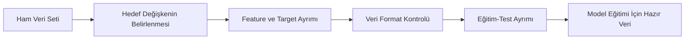

# AI/ML Tabanlı FinTech Uygulaması Geliştirme  
## AI Kredi Skorlama Sistemi Ara Raporu

**Proje Konusu:** AI Kredi Skorlama Sistemi  
**Alan:** FinTech / Kredi ve Risk Analitiği  
**Ara Rapor Kapsamı:** Problem Tanımı, Veri Seti, Yöntem / Model  
**Not:** Bu ara raporda uygulama arayüzü, sistem mimarisi, API, flow-chart ve nihai sonuçlar ayrıntılı olarak verilmemiştir. Bu kısımlar final rapor kapsamında detaylandırılacaktır.

---

## Ara Rapor Özeti

Bu ara raporda, AI/ML tabanlı bir FinTech uygulaması olarak geliştirilen **AI Kredi Skorlama Sistemi** ele alınmıştır. Projenin temel amacı, kredi başvurusu yapan bir müşterinin geri ödeme riskini tahmin eden, bu riski kredi skoruna dönüştüren ve kullanıcıya **APPROVE / REVIEW / DECLINE** şeklinde karar önerisi sunabilen bir sistem geliştirmektir.

Bu aşamada öncelikle kredi skorlama problemi tanımlanmış, problemin finans sektörü açısından önemi açıklanmış ve çalışmanın amacı belirlenmiştir. Daha sonra kullanılan veri seti incelenmiş, veri setindeki değişkenler açıklanmış ve veri ön işleme süreci değerlendirilmiştir. Son bölümde ise bu problem için kullanılabilecek makine öğrenmesi modelleri ele alınmış, model seçimi yapılırken hangi kriterlerin dikkate alınacağı yorumlanmıştır.

Bu projede kredi riski problemi yalnızca “doğru tahmin yapma” problemi olarak görülmemiştir. Kredi skorlama alanında farklı hata türlerinin farklı finansal maliyetleri olduğu için model performansı değerlendirilirken yalnızca accuracy metriğine bakmanın yeterli olmayacağı sonucuna varılmıştır. Özellikle kötü kredi riskine sahip müşterileri yakalayabilmek için **bad credit recall** metriğinin önemli olduğu değerlendirilmiştir.

---

# 1. Problem Tanımı

## 1.1 Seçilen Problemin Açıklaması

Bu projede finans teknolojileri alanında **AI kredi skorlama sistemi** problemi seçilmiştir. Kredi skorlama, bir müşterinin kredi başvurusu sırasında verdiği bilgilerden yararlanarak müşterinin krediyi geri ödeme riskini tahmin etmeyi amaçlayan bir karar destek problemidir.

Bir müşteri kredi başvurusu yaptığında finansal kurum açısından temel soru şudur:

> Bu müşteri aldığı krediyi düzenli ve güvenilir şekilde geri ödeyebilir mi?

Bu soruya doğru cevap vermek finansal kurumlar için çok önemlidir. Çünkü verilen kredi geri ödenmezse kurum doğrudan finansal zarara uğrayabilir. Diğer taraftan, aslında güvenilir olan bir müşteri yanlışlıkla reddedilirse kurum hem müşteri kaybı hem de gelir fırsatı kaybı yaşayabilir.

Bu nedenle kredi skorlama problemi hem teknik hem de iş kararları açısından dikkatli ele alınması gereken bir problemdir. Bu projede problem, makine öğrenmesi açısından bir **ikili sınıflandırma problemi** olarak değerlendirilmiştir. Modelin görevi, müşteriye ait kredi başvuru bilgilerini kullanarak müşterinin kredi riskini tahmin etmektir.

Projede hedeflenen sistem yalnızca “iyi kredi” veya “kötü kredi” tahmini yapmakla sınırlı değildir. Model çıktısının kullanıcı tarafından daha anlaşılır hale getirilmesi için aşağıdaki karar destek çıktıları da üretilmesi hedeflenmiştir:

| Çıktı | Açıklama |
|---|---|
| Kredi skoru | Müşterinin model tabanlı kredi skoru |
| Bad Credit Probability | Müşterinin kötü kredi riski olasılığı |
| Good Credit Probability | Müşterinin iyi kredi olasılığı |
| Risk Band | Low Risk, Medium Risk veya High Risk seviyesi |
| Decision | APPROVE, REVIEW veya DECLINE karar önerisi |

Bu yapı sayesinde proje sadece bir sınıflandırma modeli olmaktan çıkıp, FinTech alanında kullanılabilecek bir kredi karar destek sistemi haline getirilmeyi amaçlamaktadır.

---

## 1.2 Problemin Önemi

Kredi riski, bankalar, dijital bankacılık platformları ve FinTech şirketleri için doğrudan kârlılığı etkileyen temel problemlerden biridir. Finansal kurumlar kredi başvurularını değerlendirirken hızlı, tutarlı ve veri temelli kararlar vermek zorundadır. Özellikle dijitalleşen finans dünyasında kullanıcılar hızlı sonuç beklerken, kurumların da riskli başvuruları doğru şekilde ayırt etmesi gerekmektedir.

Geleneksel kredi değerlendirme süreçlerinde kararlar çoğu zaman sabit kurallara, geçmiş ödeme bilgilerine veya manuel değerlendirmelere dayanabilir. Bu yöntemler bazı durumlarda işe yarasa da, müşteri verisindeki karmaşık ilişkileri her zaman yeterince yakalayamayabilir. AI/ML tabanlı sistemler ise geçmiş verilerden öğrenerek müşterinin risk profilini daha sistematik biçimde değerlendirebilir.

Bu projede beni en çok ilgilendiren noktalardan biri, kredi skorlama probleminde model başarısının yalnızca yüksek doğruluk oranı ile ölçülemeyecek olmasıdır. Örneğin bir model genel olarak yüksek accuracy değerine sahip olabilir; fakat kötü kredi riskine sahip müşterileri yeterince yakalayamıyorsa bu model kredi riski açısından güvenilir olmayabilir.

Bu durumu şu şekilde yorumladım:

- İyi müşteriyi riskli tahmin etmek müşteri kaybına neden olabilir.
- Riskli müşteriyi iyi tahmin etmek finansal zarara neden olabilir.
- Kredi riski probleminde riskli müşteriyi kaçırmak daha ciddi bir hata olabilir.
- Bu nedenle model değerlendirilirken yalnızca accuracy değil, recall ve F1-score gibi metrikler de dikkate alınmalıdır.

Özellikle **bad credit recall** metriği, kötü kredi riskine sahip müşterilerin ne kadarının doğru yakalandığını gösterdiği için bu projede önemli görülmüştür. Bu nedenle model seçimi yapılırken sadece “en yüksek accuracy hangi modelde?” sorusuna değil, “riskli müşterileri hangi model daha iyi yakalıyor?” sorusuna da cevap aranmıştır.

Bu yaklaşım bana şunu göstermektedir:  
Kredi skorlama gibi finansal risk problemlerinde modelin başarısı yalnızca matematiksel bir başarı değil, aynı zamanda finansal karar kalitesiyle de ilişkilidir. Bu yüzden model seçimi yapılırken teknik metrikler ile iş problemindeki risk birlikte yorumlanmalıdır.

---

## 1.3 Çalışmanın Amacı

Bu çalışmanın amacı, kredi başvurusu yapan bir müşterinin geri ödeme riskini tahmin eden ve kullanıcıya anlaşılır çıktılar sunan AI/ML tabanlı bir FinTech sistemi geliştirmektir.

Çalışma kapsamında önce kredi skorlama problemine uygun bir veri seti seçilmiş, ardından veri setindeki değişkenler incelenmiş ve modelleme için uygun hale getirilmiştir. Sonraki aşamada farklı makine öğrenmesi modellerinin karşılaştırılması ve kredi riski problemi için en uygun yaklaşımın belirlenmesi hedeflenmiştir.

Bu projenin temel amaçları şunlardır:

| Amaç | Açıklama |
|---|---|
| Kredi riskini tahmin etmek | Müşterinin kredi geri ödeme riskini modellemek |
| Veri setini analiz etmek | Müşteri başvuru bilgilerini ve hedef değişkeni incelemek |
| Veri ön işleme yapmak | Veriyi modelin kullanabileceği forma getirmek |
| Model geliştirmek | Uygun makine öğrenmesi modellerini denemek |
| Model karşılaştırması yapmak | Accuracy, recall, precision ve F1-score gibi metriklerle değerlendirme yapmak |
| Kredi skoru üretmek | Model olasılığını kullanıcı dostu skor formatına dönüştürmek |
| Karar önerisi üretmek | APPROVE / REVIEW / DECLINE çıktısı vermek |
| Çalışan sistem hedeflemek | Modeli ilerleyen aşamada arayüz veya API üzerinden test edilebilir hale getirmek |

Bu ara raporda projenin problem tanımı, veri seti ve yöntem/model yaklaşımı açıklanmıştır. Final raporda ise uygulama ekranı, sistem mimarisi, API yapısı, model performans sonuçları ve nihai değerlendirme bölümleri ayrıntılı olarak sunulacaktır.

---

# 2. Veri Seti

## 2.1 Veri Kaynağı

Bu projede kredi skorlama problemi için **South German Credit** veri seti kullanılmıştır. Bu veri seti, kredi başvurusu yapan müşterilere ait finansal ve demografik bilgileri içermektedir. Veri seti, kredi riskini tahmin etmek amacıyla kullanılan German Credit veri seti ailesiyle ilişkilidir.

Veri setinde her satır bir müşteriyi temsil etmektedir. Her müşteri için kredi süresi, kredi tutarı, kredi geçmişi, tasarruf durumu, çalışma süresi, yaş, konut durumu, iş tipi gibi değişkenler bulunmaktadır. Bu değişkenler kullanılarak müşterinin kredi geri ödeme riski tahmin edilmeye çalışılmıştır.

Bu projede hedef değişken şu şekilde ele alınmıştır:

| Hedef Değişken | Anlamı |
|---|---|
| 0 | Kötü kredi riski |
| 1 | İyi kredi riski |

Bu yapı nedeniyle problem bir **ikili sınıflandırma problemi** olarak modellenmiştir.

Veri setinin bu proje için uygun olduğunu düşünüyorum. Çünkü veri seti yalnızca tek bir finansal değişken içermemektedir; müşterinin kredi geçmişi, gelir/ödeme yüküyle ilişkili olabilecek bilgiler, çalışma süresi ve konut durumu gibi farklı açılardan kredi riskine etki edebilecek değişkenleri birlikte sunmaktadır. Bu da makine öğrenmesi modeli için anlamlı bir tahmin ortamı oluşturmaktadır.

---

## 2.2 Veri İçeriği ve Feature Açıklamaları

Veri setindeki değişkenler müşterinin kredi başvurusuna, finansal durumuna ve bazı demografik özelliklerine ilişkin bilgiler içermektedir. Model bu değişkenlerden yararlanarak müşterinin kredi riskini tahmin etmektedir.

Aşağıdaki tabloda projede kullanılan temel değişkenler ve bu değişkenlerin kredi riski açısından anlamları verilmiştir:

| Feature | Açıklama | Kredi Riski Açısından Yorumu |
|---|---|---|
| status | Müşterinin mevcut hesap durumu | Hesap durumu zayıfsa finansal risk artabilir |
| duration | Kredinin süresi | Uzun vadeli kredilerde belirsizlik daha fazla olabilir |
| credit_history | Müşterinin geçmiş kredi davranışı | Geçmiş ödeme davranışı risk tahmininde önemli olabilir |
| purpose | Kredinin kullanım amacı | Kredi amacı risk profilini etkileyebilir |
| amount | Talep edilen kredi tutarı | Yüksek kredi tutarı geri ödeme yükünü artırabilir |
| savings | Tasarruf durumu | Düşük tasarruf seviyesi finansal tamponun zayıf olduğunu gösterebilir |
| employment_duration | Çalışma süresi | Uzun çalışma süresi gelir istikrarı açısından olumlu olabilir |
| installment_rate | Taksit yükü | Taksit yükü arttıkça ödeme zorluğu oluşabilir |
| personal_status_sex | Kişisel durum ve cinsiyet bilgisi | Veri setindeki demografik değişkenlerden biridir |
| other_debtors | Ortak borçlu veya kefil durumu | Kefil/ortak borçlu varlığı riski etkileyebilir |
| present_residence | Mevcut adreste yaşama süresi | Yerleşim istikrarı açısından yorumlanabilir |
| property | Mülk durumu | Varlık sahibi olmak finansal güç göstergesi olabilir |
| age | Müşteri yaşı | Finansal istikrar ve gelir düzeniyle ilişkili olabilir |
| other_installment_plans | Başka taksit planları | Ek ödeme yükümlülükleri riski artırabilir |
| housing | Konut durumu | Kira veya ev sahibi olma durumu finansal yükü etkileyebilir |
| number_credits | Mevcut kredi sayısı | Fazla kredi sayısı borç yükünü artırabilir |
| job | İş tipi | Gelir düzenliliği açısından önemli olabilir |
| people_liable | Bakmakla yükümlü olunan kişi sayısı | Müşterinin finansal sorumluluğunu etkileyebilir |
| telephone | Telefon kaydı | Veri setindeki başvuru değişkenlerinden biridir |
| foreign_worker | Yabancı çalışan durumu | Veri setindeki başvuru değişkenlerinden biridir |

Bu değişkenleri incelediğimde kredi riskinin tek bir değişkene bağlı olmadığını gördüm. Örneğin yalnızca kredi tutarına bakarak karar vermek yeterli değildir. Kredi tutarı düşük olsa bile müşterinin tasarrufu zayıf, taksit yükü yüksek veya kredi geçmişi problemli olabilir. Benzer şekilde yüksek kredi tutarı her zaman kötü kredi anlamına gelmeyebilir; eğer müşterinin çalışma süresi, tasarruf durumu ve kredi geçmişi olumluysa risk daha dengeli olabilir.

Bu nedenle modelin birden fazla değişkeni birlikte değerlendirmesi gerekmektedir. Bu durum, kredi skorlama problemini makine öğrenmesi için uygun hale getirmektedir.

---

## 2.3 Veri Ön İşleme Adımları

Makine öğrenmesi modelleri ham veriyi doğrudan her zaman sağlıklı şekilde kullanamaz. Bu nedenle veri ön işleme aşaması model performansı açısından önemli bir adımdır. Bu projede veri seti modelleme için hazırlanırken verinin hedef değişkeni belirlenmiş, girdi değişkenleri ayrılmış ve modelin kullanabileceği format oluşturulmuştur.

Veri ön işleme sürecinde uygulanan temel adımlar aşağıdaki gibidir:

| Adım | Açıklama | Neden Gerekli? |
|---|---|---|
| Hedef değişkenin belirlenmesi | `credit_risk` hedef değişken olarak ele alınmıştır | Modelin neyi tahmin edeceğini belirlemek için |
| Feature-target ayrımı | Girdi değişkenleri `X`, hedef değişken `y` olarak ayrılmıştır | Eğitim sürecini düzenlemek için |
| Veri format kontrolü | Değişkenlerin modelin beklediği formatta olması sağlanmıştır | Tahmin sırasında hata oluşmaması için |
| Kategorik değişkenlerin ele alınması | Sayısal kodlu kategorik değişkenler modelde kullanılacak şekilde düzenlenmiştir | Modelin kategorik bilgileri işleyebilmesi için |
| Eğitim-test ayrımı | Veri eğitim ve test kümelerine ayrılmıştır | Modelin genelleme başarısını ölçmek için |
| Sınıf dengesizliği değerlendirmesi | Kötü kredi sınıfının yakalanması ayrıca dikkate alınmıştır | Kredi riski açısından kritik sınıfı kaçırmamak için |
| Pipeline yaklaşımı | Ön işleme ve model adımları aynı tahmin akışında düşünülmüştür | Eğitim ve tahmin süreçlerinin tutarlı olması için |

Bu aşamada özellikle dikkat ettiğim nokta, eğitimde kullanılan veri formatı ile tahmin aşamasında kullanılacak veri formatının aynı olmasıdır. Çünkü kredi skorlama sistemleri yalnızca model eğitimiyle bitmez; modelin gerçek veya örnek müşteri verisi geldiğinde aynı feature yapısıyla tahmin üretebilmesi gerekir.

Bu nedenle veri ön işleme sürecini sadece teknik bir hazırlık olarak değil, sistemin güvenilir çalışması için gerekli bir aşama olarak değerlendirdim.

Veri ön işleme süreci genel olarak şu şekilde özetlenebilir:



Bu akış, verinin doğrudan modele verilmediğini; önce problem yapısına uygun hale getirildiğini göstermektedir.

---

## 2.4 Örnek Veri Seti

Aşağıdaki tablo, veri setindeki bir müşteri kaydının model açısından nasıl temsil edilebileceğini göstermektedir. Bu tablo, modelin kullandığı başvuru değişkenlerini daha anlaşılır göstermek amacıyla hazırlanmıştır.

| Feature | Örnek Değer | Açıklama |
|---|---:|---|
| status | 1 | Mevcut hesap durumu |
| duration | 24 | Kredi süresi |
| credit_history | 2 | Kredi geçmişi |
| purpose | 3 | Kredi amacı |
| amount | 3000 | Kredi tutarı |
| savings | 2 | Tasarruf seviyesi |
| employment_duration | 3 | Çalışma süresi |
| installment_rate | 4 | Taksit yükü |
| personal_status_sex | 3 | Kişisel durum bilgisi |
| other_debtors | 1 | Ortak borçlu/kefil durumu |
| present_residence | 2 | Mevcut adreste yaşama süresi |
| property | 2 | Mülk durumu |
| age | 35 | Müşteri yaşı |
| other_installment_plans | 3 | Başka taksit planları |
| housing | 2 | Konut durumu |
| number_credits | 1 | Mevcut kredi sayısı |
| job | 3 | İş tipi |
| people_liable | 2 | Bakmakla yükümlü olunan kişi sayısı |
| telephone | 1 | Telefon kaydı |
| foreign_worker | 2 | Yabancı çalışan durumu |

Bu örnek kayıt üzerinden şu yoruma vardım: model, müşteriyi sadece tek bir değer üzerinden değerlendirmemektedir. Kredi tutarı, kredi süresi, tasarruf seviyesi, taksit yükü, çalışma süresi ve kredi geçmişi gibi değişkenler birlikte değerlendirilmektedir. Bu nedenle AI/ML tabanlı yaklaşım, kredi skorlama probleminde daha kapsamlı bir değerlendirme yapabilmek için uygundur.

---

# 3. Yöntem / Model

## 3.1 Kullanılan Modeller

Bu projede kredi skorlama problemi için birden fazla makine öğrenmesi modeli değerlendirilmiştir. Bunun nedeni, doğrudan tek bir modeli seçmek yerine farklı modellerin güçlü ve zayıf yönlerini karşılaştırarak daha bilinçli bir seçim yapmaktır.

Kredi skorlama problemi için değerlendirilen modeller aşağıdaki gibidir:

| Model | Kullanım Amacı | Avantajı | Sınırlılığı |
|---|---|---|---|
| Logistic Regression | Temel sınıflandırma modeli | Hızlı, anlaşılır ve yorumlanabilir | Doğrusal ilişkilerde daha başarılıdır |
| Balanced Logistic Regression | Sınıf dengesizliğini dikkate alan model | Riskli sınıfı daha iyi yakalayabilir | Genel accuracy değeri bir miktar düşebilir |
| Decision Tree | Kural tabanlı karar yapısını görmek | Yorumlaması kolaydır | Overfitting riski vardır |
| Random Forest | Birden fazla karar ağacını birleştirmek | Daha kararlı ve güçlü tahmin verebilir | Yorumlanabilirliği daha düşüktür |

Bu modeller arasından özellikle Logistic Regression ve Balanced Logistic Regression modelleri kredi skorlama problemi için önemli görülmüştür. Logistic Regression, finansal risk problemlerinde sık kullanılan, yorumlanabilir ve temel bir modeldir. Balanced Logistic Regression ise sınıf dengesizliği durumunda riskli sınıfın daha iyi yakalanmasına yardımcı olabilir.

Decision Tree modeli, kararların ağaç yapısı üzerinden açıklanabilmesi nedeniyle değerlidir. Ancak tek bir karar ağacı bazı durumlarda eğitim verisine fazla uyum sağlayabilir. Random Forest ise birden fazla karar ağacını birleştirerek daha kararlı sonuçlar üretebilir; fakat yorumlanabilirliği Logistic Regression kadar kolay değildir.

Bu aşamada şu sonuca vardım:  
Kredi skorlama probleminde modelin sadece iyi tahmin yapması değil, aynı zamanda karar mantığının açıklanabilir olması da önemlidir. Bu nedenle model seçiminde hem performans hem de yorumlanabilirlik birlikte düşünülmelidir.

---

## 3.2 Model Seçimi Gerekçesi

Kredi skorlama probleminde model seçimi yapılırken yalnızca accuracy değerine bakmak yeterli değildir. Accuracy, tüm tahminler içindeki doğru tahmin oranını gösterir. Ancak kredi riski probleminde hata türleri aynı öneme sahip değildir.

Örneğin:

| Hata Türü | Olası Sonuç |
|---|---|
| İyi müşteriyi riskli tahmin etmek | Müşteri kaybı ve fırsat kaybı |
| Riskli müşteriyi iyi tahmin etmek | Finansal zarar ve kredi geri ödenmeme riski |

Bu iki hata karşılaştırıldığında, riskli müşteriyi iyi müşteri olarak sınıflandırmak daha kritik bir hata olarak değerlendirilebilir. Çünkü bu durumda kurum doğrudan finansal kayıp yaşayabilir. Bu nedenle bu projede model seçimi yapılırken özellikle **bad credit recall** metriğine dikkat edilmiştir.

Model değerlendirmesinde dikkate alınması planlanan metrikler şunlardır:

| Metrik | Anlamı | Kredi Riski Açısından Yorumu |
|---|---|---|
| Accuracy | Tüm tahminler içinde doğru tahmin oranı | Genel başarıyı gösterir fakat tek başına yeterli değildir |
| Precision | Riskli tahmin edilenlerin ne kadarının gerçekten riskli olduğu | Yanlış alarm oranını değerlendirmek için önemlidir |
| Recall | Gerçek riskli müşterilerin ne kadarının yakalandığı | Kredi riski açısından kritik bir metriktir |
| F1-score | Precision ve recall dengesini gösterir | Dengesiz veri setlerinde faydalıdır |
| Confusion Matrix | Sınıflandırma hatalarını gösterir | Hangi sınıfta hata yapıldığını analiz etmeyi sağlar |

Bu metrikleri incelediğimde özellikle recall değerinin kredi riski probleminde çok önemli olduğunu gördüm. Çünkü model riskli müşterileri yakalayamazsa, sistem finansal açıdan hatalı kararlar üretebilir.

Bu nedenle Balanced Logistic Regression modeli final model adayı olarak öne çıkmaktadır. Standart Logistic Regression modeli daha yüksek genel accuracy verebilir; fakat kötü kredi sınıfını yakalama başarısı düşükse kredi riski açısından yeterli olmayabilir. Balanced Logistic Regression ise sınıflar arasındaki dengesizliği dikkate alarak riskli müşterileri daha iyi yakalamayı hedefler.

Bu noktada vardığım yorum şudur:  
Bir kredi skorlama sisteminde “en doğru model” her zaman en yüksek accuracy veren model değildir. Kredi riski bağlamında en doğru model, finansal açıdan kritik hataları azaltan ve riskli müşterileri daha başarılı yakalayan modeldir.

---

## 3.3 Beklenen Model Çıktıları

Geliştirilecek modelin yalnızca sınıf tahmini üretmesi yeterli görülmemiştir. Çünkü kullanıcı veya finansal karar verici için yalnızca “0” veya “1” şeklinde bir çıktı yeterince açıklayıcı değildir. Bu nedenle model çıktısının daha anlaşılır hale getirilmesi planlanmıştır.

Beklenen model çıktıları aşağıdaki gibidir:

| Model Çıktısı | Açıklama |
|---|---|
| Prediction | Modelin sınıf tahmini |
| Prediction Label | İyi kredi veya kötü kredi yorumu |
| Bad Credit Probability | Müşterinin kötü kredi riski olasılığı |
| Good Credit Probability | Müşterinin iyi kredi olasılığı |
| Credit Score | 300–850 aralığında model tabanlı kredi skoru |
| Decision | APPROVE / REVIEW / DECLINE |
| Risk Band | Low Risk / Medium Risk / High Risk |

Bu çıktı yapısını özellikle seçtim çünkü kredi skorlama sistemleri yalnızca teknik model çıktısı üretmemelidir. Kullanıcı, müşteri veya finansal karar verici sistem sonucunu kolayca anlayabilmelidir.

Model çıktısının karar sürecine dönüştürülmesi şu mantığa dayanmaktadır:

```text
Kötü kredi olasılığı arttıkça kredi skoru düşer.
Kötü kredi olasılığı azaldıkça kredi skoru yükselir.
Kredi skoru ve risk olasılığına göre karar önerisi üretilir.
```

Bu yaklaşım sayesinde model sonucu şu şekilde yorumlanabilir:

| Risk Durumu | Beklenen Karar |
|---|---|
| Düşük kötü kredi olasılığı | APPROVE |
| Orta seviye kötü kredi olasılığı | REVIEW |
| Yüksek kötü kredi olasılığı | DECLINE |

Genel model akışı şu şekilde tasarlanmıştır:


Bu yapı bana şunu göstermektedir:  
Model yalnızca tahmin yapan bir araç olarak değil, karar destek sistemi olarak düşünülmelidir. Bu nedenle proje sonunda hedeflenen sistem, müşteri verisini input olarak alıp kredi skoru ve karar önerisi döndüren çalışan bir FinTech uygulaması olacaktır.

---

## Ara Rapor Genel Değerlendirmesi

Bu ara rapor aşamasında proje için seçilen problem, kullanılan veri seti ve modelleme yaklaşımı açıklanmıştır. Kredi skorlama probleminin finansal risk açısından önemli olduğu, bu nedenle model seçiminin yalnızca genel doğruluk oranına göre yapılamayacağı değerlendirilmiştir.

Veri seti incelendiğinde müşterinin kredi riskini etkileyebilecek birçok farklı değişken olduğu görülmüştür. Bu nedenle problem tek bir değişkene bağlı basit bir karar problemi olarak değil, çok değişkenli bir sınıflandırma problemi olarak ele alınmıştır.

Modelleme yaklaşımında Logistic Regression, Balanced Logistic Regression, Decision Tree ve Random Forest gibi modellerin değerlendirilebileceği belirtilmiştir. Bu modeller arasında özellikle Balanced Logistic Regression modeli, kötü kredi sınıfını daha iyi yakalama potansiyeli nedeniyle önemli görülmüştür.

Bu aşamada vardığım temel sonuç şudur:

> Kredi skorlama problemlerinde başarılı bir AI/ML sistemi geliştirmek için yalnızca yüksek accuracy elde etmek yeterli değildir. Modelin riskli müşterileri yakalama başarısı, kararların finansal etkisi ve çıktının kullanıcı tarafından anlaşılabilir olması birlikte değerlendirilmelidir.

Final rapor aşamasında bu ara raporda açıklanan problem, veri seti ve modelleme yaklaşımı üzerine geliştirilen çalışan sistem; Streamlit arayüzü, FastAPI backend yapısı, sistem mimarisi, performans sonuçları ve değerlendirme bölümleriyle birlikte sunulacaktır.